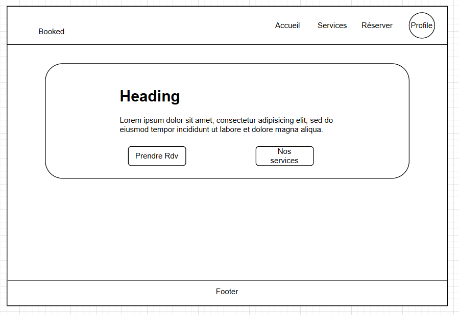
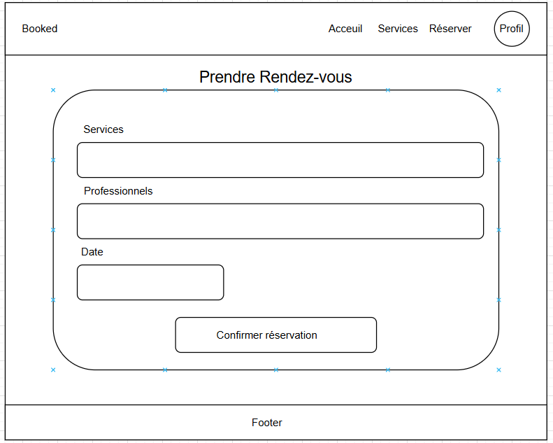
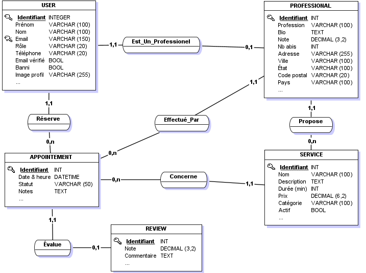

# Booked

## 1. Contexte et Description

Booked est une application SaaS (Software as a Service) destinée aux petits professionnels tels que les salons de coiffure, les instituts de beauté, et autres prestataires de services nécessitant un système de réservation. L'objectif principal est de simplifier la gestion des rendez-vous via une application web accessible et intuitive ainsi qu'une application mobile.

L'application permettra à ces professionnels de digitaliser leur système de réservation, d'améliorer l'expérience client et d'optimiser la gestion de leur planning au quotidien.

## 2. Fonctionnalités

### Fonctionnalités pour les professionnels (Business Owners)

- **Gestion de compte professionnel**

  - Création et personnalisation du profil entreprise
  - Paramétrage des horaires d'ouverture
  - Configuration des services proposés et leurs durées
  - Définition des tarifs

- **Gestion du calendrier**

  - Visualisation des réservations (vue journalière, hebdomadaire, mensuelle)
  - Blocage de créneaux pour indisponibilités
  - Gestion des congés et jours fériés

- **Gestion des réservations**

  - Acceptation/refus manuel ou automatique des demandes
  - Modification/annulation de rendez-vous
  - Envoi de notifications aux clients

- **Gestion des clients**

  - Base de données clients avec historique
  - Notes et préférences par client
  - Statistiques et historique de fréquentation

### Fonctionnalités pour les clients

- **Gestion de compte client**

  - Création et gestion de profil
  - Historique des rendez-vous
  - Notifications et rappels

- **Réservation en ligne**

  - Recherche par type de service
  - Sélection de date et d'heure disponibles
  - Choix du prestataire (si applicable)

- **Gestion des rendez-vous**
  - Modification de réservation
  - Annulation de rendez-vous
  - Rappels automatiques

## 3. Wireframe




## 4. MCD de la BDD



## 5. Choix des Technologies

### Frontend

- **Framework** : React avec TypeScript pour le typage
- **Routage** : React Router pour le routage
- **Styles** : TailwindCSS pour le design responsive
- **Interface utilisateur** : Composants personnalisés avec Material UI
- **Gestion des dates** : date-fns, react-datepicker pour la gestion des calendriers
- **Requêtes API** : Axios pour la facilitiation de l'API
- **Icônes** : React Icons pour les diverses icones

### Backend

- **Framework** : Node.js avec Express
- **Langage** : TypeScript avec Node pour le typage
- **Base de données** : MongoDB pour une plus grande flexibilité dans les tables
- **Authentification** : JWT (JSON Web Token) pour facilité la connection utilisateur
- **Sécurité** : bcrypt pour le hachage des mots de passe
- **Communication par email** : Nodemailer pour l'envoie des mails au utilisateurs
- **Gestion des fichiers** : Multer pour les uploads de fichiers

### Infrastructure

- **Déploiement** :Déployemet sur les stores de l'application mobile (Android, Apple), avec financement nécessaire.

### Prérequis

- Node.js
- npm
- MongoDB installé localement ou accès à une instance MongoDB (Atlas)
- Un éditeur de code
- Git

### Installation

1. **Cloner le dépôt**

   ```
   git clone <URL_du_dépôt>
   cd Booked
   ```

2. **Installation des dépendances**

   ```
   npm install
   cd client && npm install
   cd ../server && npm install
   ```

3. **Configuration des variables d'environnement**

   - Créer un fichier `.env` dans le dossier `server` en s'inspirant du modèle `.env.example`
   - Configurer les variables nécessaires (connexion MongoDB, clés JWT, etc.)

4. **Lancement de l'application en développement**

   ```
   # À la racine du projet
   npm run dev
   ```

   Cette commande lancera simultanément le serveur backend et l'application frontend.

5. ## Auteurs
   Enzo TURPIN &
   Daryl MATRO
